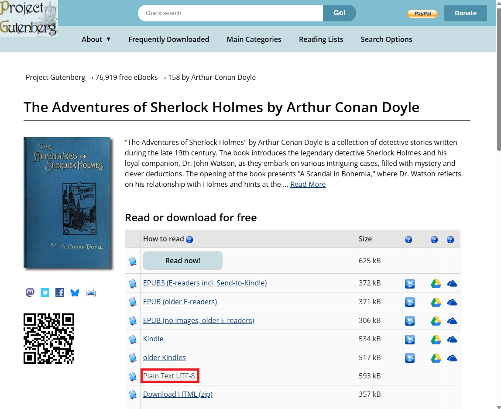
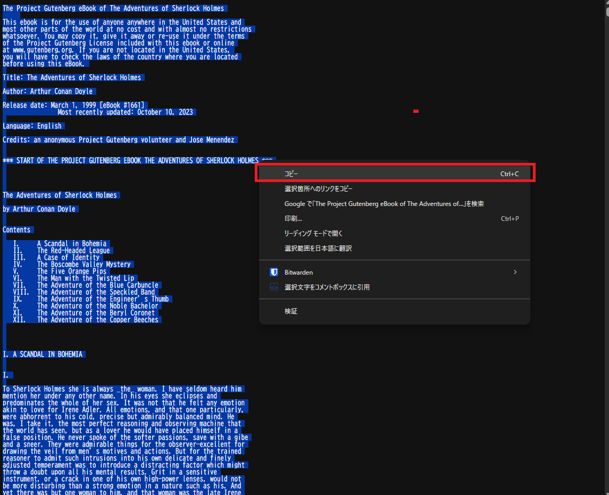
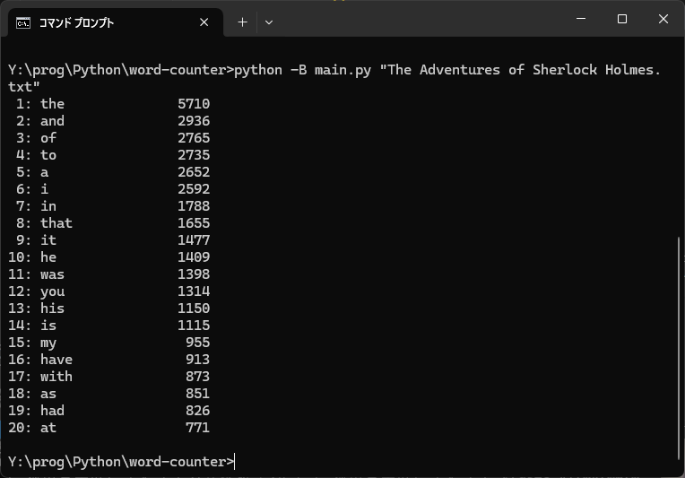

# word-counter

## 概要 (Overview)

`word-counter`は、テキストファイル内の単語の出現頻度をカウントし、上位20件をランキング形式で表示するコマンドラインツールです。シンプルな操作で、英文のテキスト分析を手軽に行うことができます。

このツールは、Pythonのハンズオントレーニングの一環として開発されました。

## 特徴 (Features)

*   **単語頻度カウント**: 指定されたテキストファイル内の各単語の出現回数を正確にカウントします。
*   **ランキング表示**: 出現頻度の高い順に単語をソートし、上位20件を表示します。
*   **大文字/小文字の区別なし**: すべての単語を小文字に変換してカウントするため、「The」と「the」は同じ単語として扱われます。
*   **基本的な句読点の除去**: `.` `,` `!` `?` などの一般的な句読点を自動的に除去し、純粋な単語のみをカウント対象とします。

## 動作環境 (Requirements)

*   Python 3

## セットアップ (Setup)

* 以下のコマンドを使用して、このリポジトリをクローンします。
    ```bash
    git clone https://github.com/qack-dev/word-counter.git
    cd word-counter
    ```

## 使い方 (Usage)

### ステップ1: テキストの準備

解析したいテキストファイルを `text` ディレクトリに配置する必要があります。

ここでは例として、[Project Gutenberg](https://www.gutenberg.org/)で公開されている[『The Adventures of Sherlock Holmes』](https://www.gutenberg.org/ebooks/1661)をダウンロードして準備する手順を説明します。

1.  ダウンロードページにアクセスし、「Plain Text UTF-8」をクリックしてテキストを表示します。

    

2.  ブラウザで開いたテキストのページで、`Ctrl+A`（すべて選択）を押し、次に`Ctrl+C`（コピー）を押して、すべてのテキストをコピーします。

    

3.  お使いのテキストエディタを開き、コピーした内容を貼り付けます。
4.  このプロジェクトの`text`ディレクトリ内に、`The Adventures of Sherlock Holmes.txt`のような分かりやすい名前を付けて、ファイルを保存します。

### ステップ2: コマンドの実行

ターミナル（またはコマンドプロンプト）を開き、以下のコマンドを実行します。ファイル名は、`text`ディレクトリに保存した名前に置き換えてください。

```bash
python -B main.py "The Adventures of Sherlock Holmes.txt"
```

コマンドが正常に実行されると、以下のように単語の出現頻度ランキングが表示されます。



## 制約事項 (Limitations)

*   **日本語非対応**: このツールは、単語の区切りを半角スペースに依存しています。そのため、日本語のように単語と単語の間にスペースを入れない（分かち書きのない）言語の解析には対応していません。
